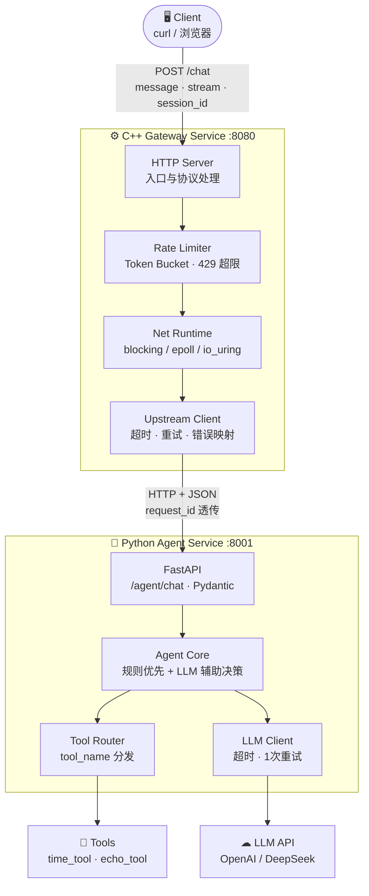
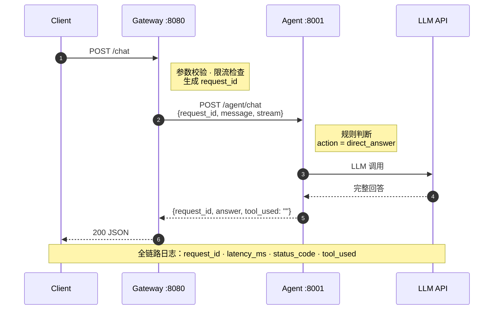
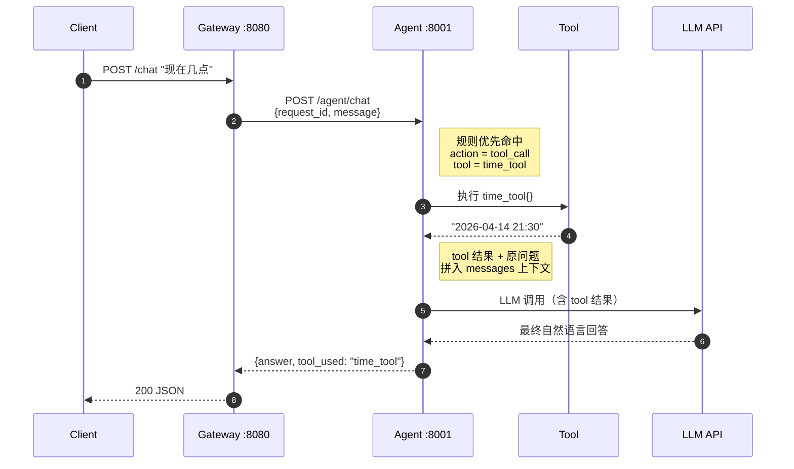
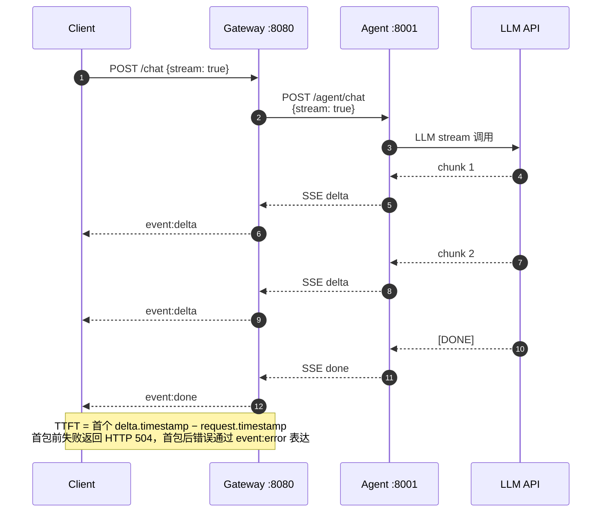

# Cyrus-GW 5 分钟演示脚本与讲解材料（TODO 4.4）

> 目的：面试或技术评审时，5 分钟内完整展示项目核心价值。  
> 受众：面试官（校招/社招一面二面）、技术评审者。  
> 前置条件：Linux VM 已编译并可启动 Gateway + Agent。

---

## 1. 架构图（双服务）



**一句话定位**（背熟）：

> 一个面向 LLM 流式接入场景的 C++20 AI Gateway：基于 io_uring + 协程实现异步 I/O 调度，
> 并提供 epoll Reactor 对照基线、SSE 透传、Token Bucket 限流、request_id 链路日志与
> wrk 压测分析。

---

## 2. 时序图

### 2.1 普通对话（直接回答）



### 2.2 工具调用对话（tool_call → LLM 回填）



### 2.3 流式 SSE 对话



---

## 3. 五分钟演示流程

> 按时间分配：开场 30s → 非流式 60s → 流式 60s → Tool 60s → 限流 30s → 压测 60s → 总结 30s

### 第 1 步：开场介绍（30 秒）

**口播模板**：

> 这个项目叫 Cyrus-GW，核心是一个 C++20 + io_uring 驱动的 AI 网关，
> 搭配 Python Agent 做任务决策和 Tool 调用。
> 架构是两个服务：C++ 网关负责接入、限流、转发和 SSE 透传；
> Python Agent 负责 LLM 调用和工具编排。
> 下面我用 curl 演示几个核心路径。

### 第 2 步：非流式对话（60 秒）

```bash
# 终端 1：确认服务已启动
curl -sS http://127.0.0.1:8080/health | python3 -m json.tool

# 终端 1：非流式对话
curl -sS -w '\n' -X POST http://127.0.0.1:8080/chat \
  -H "Content-Type: application/json" \
  -d '{"message":"hello","stream":false}' | python3 -m json.tool
```

**讲解要点**：

- 指出响应中的 `request_id`
- 指出 Gateway 日志中的 `latency_ms`
- 指出 Gateway 日志行中的 `status_code`、`tool_used`

### 第 3 步：流式 SSE 对话（60 秒）

```bash
curl -N -X POST http://127.0.0.1:8080/chat \
  -H "Content-Type: application/json" \
  -d '{"message":"请用三句话介绍自己","stream":true}'
```

**讲解要点**：

- 逐行看 `event: delta` → `event: done`
- 强调"Gateway 不缓存全量，按 chunk 透传给客户端"
- 如果被问 TTFT：指出日志中的 `ttft_ms` 字段

### 第 4 步：Tool 调用路径（60 秒）

```bash
curl -sS -w '\n' -X POST http://127.0.0.1:8080/chat \
  -H "Content-Type: application/json" \
  -d '{"message":"现在几点了","stream":false}' | python3 -m json.tool
```

**讲解要点**：

- 响应中 `tool_used: "time_tool"` 证明走了工具路径
- 解释决策过程：Agent 规则匹配 → 调 time_tool → 结果回填 LLM → 最终回答
- 这条规则命中的 time_tool 路径是“0 次决策 LLM + 1 次最终回答 LLM”
- 只有复杂场景未命中规则时，才会变成“LLM 决策 + LLM 最终回答”两次调用

### 第 5 步：限流演示（30 秒）

```bash
# 先触发限流（快速连续发送）
for i in $(seq 1 10); do
  curl -sS -o /dev/null -w "req=$i status=%{http_code}\n" \
    -X POST http://127.0.0.1:8080/chat \
    -H "Content-Type: application/json" \
    -d '{"message":"test","stream":false}' &
done
wait
```

**讲解要点**：

- 看到部分请求返回 `429`
- 指出 Gateway 日志中的 `tool_used=rate_limited`

### 第 6 步：压测结果展示（60 秒）

**口播模板**：

> 我们用 wrk 和自研 TTFT 脚本做了 io_uring vs epoll 的同机对比压测，
> 覆盖并发 100/300/500 三个档位。

**核心数据**（从 `BENCHMARK_RESULTS.md` 提取，直接讲）：

| 对比维度 | epoll | io_uring | 差异 |
|---|---|---|---|
| C=100 RPS | 37.22 | 37.99 | +2.1% |
| C=500 RPS | 6.03 | **13.00** | **+115.6%** |
| C=100 P50 延迟 | 2.27s | 2.24s | ↓1.3% |
| TTFT 全档位成功率 | 100% | 100% | 均无超时 |

> 关键结论：极限并发 C=500 下 io_uring 吞吐是 epoll 的 2.15 倍。
> 原因是 io_uring 的 Proactor 模型用 SQE/CQE 批量提交，减少系统调用开销，
> 在连接数远超处理能力时仍能高效维持连接生命周期。

### 第 7 步：总结收尾（30 秒）

**口播模板**：

> 总结一下：这个项目的核心价值是——
> 1）C++ 高并发网关，用 io_uring + 协程实现；
> 2）Python Agent 做 AI 决策和 Tool 编排；
> 3）有真实压测数据证明 io_uring 在极限并发下的优势。
> 后续可以扩展多 worker Agent、Redis 持久化、Docker 部署，
> 但当前 MVP 刻意收敛，保证 4 周交付。

---

## 4. 常见追问与答辩点

### 4.1 架构与设计取舍

**Q：为什么用两个服务，不放一个进程里？**

> A：职责分离。C++ 擅长高并发 I/O，Python 擅长 AI 逻辑和快速迭代。
> 合并会导致 C++ 里嵌入 Python 解释器，增加复杂度且无法独立扩缩。
> 两服务通过 HTTP+JSON 通信，接口契约清晰，可独立部署和测试。

**Q：为什么不用 gRPC？**

> A：MVP 刻意收敛。HTTP+JSON 开发调试成本最低，curl 即可验证。
> gRPC 带来的序列化性能优势在当前瓶颈（Agent+LLM 延迟占 99%）下不明显。
> 后续如果 Agent 变成多实例 + 高频调用，可以平滑替换为 gRPC。

**Q：Gateway 为什么不承载 AI 逻辑？**

> A：遵循"网关只做接入"原则。AI 逻辑迭代快（prompt 工程、tool 扩展），
> 放在 Python 里可以做到"改 prompt 重启即生效"；放 C++ 里每次改都要重编译。
> Gateway 的价值是稳定的接入与转发层，不应被 AI 逻辑频繁变更拖累。

### 4.2 并发模型与性能

**Q：为什么主线选 io_uring 而不是 epoll？**

> A：六个维度——
> 1）编程模型：协程 co_await 顺序写法，无回调地狱
> 2）I/O 模型：Proactor，内核完成 I/O 后通知用户态，比 Reactor 少一次 syscall
> 3）批量提交：SQE/CQE 机制摊薄 syscall 开销
> 4）数据支撑：C=500 时 io_uring 吞吐是 epoll 的 2.15 倍
> 5）连接管理：协程栈 KB 级，适合万级并发连接
> 6）数据口径：非流式高并发吞吐优势最明确，流式 TTFT 两者整体接近

**Q：压测瓶颈在 Agent 为什么还能看出 Gateway 差异？**

> A：正因为 Agent 是瓶颈（~37 RPS），Gateway 需要同时维护大量"等待 Agent 响应"
> 的连接。C=500 时 epoll 模式只能在 15s 内完成 91 个请求，io_uring 完成 196 个。
> 差异体现在"连接维持和调度效率"而非"请求处理速度"。
> 生产环境中 Agent 换成多 worker + 真实 LLM，Gateway 差异会进一步放大。

**Q：TTFT 两者差不多，怎么解释？**

> A：TTFT 衡量的是"首 token 到达时间"，瓶颈在 Agent→LLM 的推理延迟上。
> Gateway 层只做 SSE 透传，几乎不贡献额外延迟。
> 如果把 Agent 换成多 worker 部署，让瓶颈转移到 Gateway，
> io_uring 的 batching 优势在 TTFT 上也会显现。

**Q：为什么 C=500 全超时但你还说 io_uring 更好？**

> A：超时是因为 Agent 单 worker 处理不过来。但在相同约束下，
> io_uring 完成了 196 个请求 vs epoll 的 91 个——说明 io_uring 的连接管理
> 在饱和状态下仍有余力处理更多请求，"优雅降级"能力更强。

### 4.3 SSE 与流式

**Q：Gateway 怎么做 SSE 透传的？**

> A：Gateway 收到 Agent 的 chunked HTTP 响应后，剥离 Transfer-Encoding
> 编码头，提取真实 SSE payload（event/data 格式），原样转发给客户端。
> 不缓存全量内容，逐 chunk 写入客户端 socket。
> 有首包超时（sse.first_chunk_timeout_ms）和总超时控制，
> 超时后向客户端发送 event:error 并断开连接。

**Q：流式错误怎么处理？**

> A：如果首个 chunk 在超时窗口内没到，Gateway 直接返回 HTTP 504。
> 如果流已经开始再发生超时或上游异常，就不再改 HTTP 状态码，
> 而是通过 `event:error` 向客户端表达错误并结束连接。

### 4.4 Agent 与 Tool

**Q：Agent 怎么决定用不用 tool？**

> A：两级决策——
> 1）规则优先：关键词命中（如"几点""时间"）直接走 time_tool
> 2）LLM 辅助：复杂场景由 LLM 返回结构化 action（direct_answer / tool_call）
> 规则优先保证可复现性和低延迟，LLM 辅助保证灵活性。

**Q：tool 执行失败怎么办？**

> A：有兜底机制。tool 执行异常时捕获错误，Agent 降级为直接回答路径，
> 不会因为一个 tool 失败导致整个请求崩溃。
> 响应中 `tool_used` 为空，Agent warning 日志会保留 tool 名称、错误码和 detail；
> 当前 access log 的 `error_layer` 只按 `gateway / agent / llm` 三层归类。

**Q：tool 安全性？比如 shell_tool？**

> A：shell_tool（如果有）必须使用白名单命令集，只允许预定义的安全命令。
> 当前 MVP 只实现了 time_tool 和 echo_tool，不涉及系统命令执行。
> 所有外部 API key 走环境变量，不进仓库。

### 4.5 工程实践与风险

**Q：开发过程中遇到过什么问题？**

> A：（从 TIL.md 提炼，参见下文 §5 Top 问题）举 2-3 个即可。

**Q：后续演进方向？**

> A：MVP 稳定后可以考虑——
> 1）Agent 多 worker 部署，解除单 worker 瓶颈
> 2）Redis 做 session memory 持久化
> 3）Docker 化一键部署
> 4）接入更多 LLM provider（已有抽象层，只需新增 adapter）
> 5）更丰富的 tool 生态（搜索、数据库查询等）
>
> 但核心原则不变：网关只做接入，AI 逻辑留在 Agent。

**Q：这个项目的边界在哪里？什么不做？**

> A：明确不做——分布式、多 Agent 协作、gRPC、多租户、cost 计费。
> 原因是 4 周交付周期内这些都是"有投入无产出"的过度设计。
> 面试中能明确说"不做什么"比"什么都做一点"更有价值。

---

## 5. TIL Top 问题提炼（全阶段汇总）

从 `TIL.md` 全部 14 条记录中提炼出最具代表性的 5 个问题，
面试中被追问"开发遇到的困难"时可直接使用。

### Top 1：Mock LLM 单线程导致压测全超时（Week 4）

- **现象**：wrk C=300/500 输出 0 请求，C=100 仅 7 RPS 且 60% 超时
- **根因**：Python `HTTPServer` 单线程串行处理，成为压测瓶颈
- **修复**：改为 `ThreadingHTTPServer` + wrk `--timeout 10s`
- **教训**：**压测环境中 mock 服务的并发能力必须匹配被测系统**，否则测的是 mock 不是 Gateway

### Top 2：io_uring 在 RHEL 9 默认被禁用（Week 4）

- **现象**：`io_uring_setup` 返回 `EPERM`，所有 worker 初始化失败
- **根因**：RHEL 9 默认 `kernel.io_uring_disabled=2`（安全加固）
- **修复**：启动前探测 + 诊断输出 + `sysctl -w kernel.io_uring_disabled=0`
- **教训**：**内核特性可用 ≠ 发行版默认启用**，需要在运行时做 capability 探测

### Top 3：SSE chunked 编码未剥离（Week 2）

- **现象**：`curl -N` 输出混入十六进制长度行（`96`、`0`）
- **根因**：Gateway 原样透传 Agent 的 `Transfer-Encoding: chunked`，未解码
- **修复**：在 `agent_client.cpp` 增加 chunked 解码器
- **教训**：**HTTP 代理层必须处理传输编码**，不能假设上游响应格式

### Top 4：验收脚本 JSON 格式不匹配（Week 3）

- **现象**：断言全部 FAIL，但实际功能已正确
- **根因**：FastAPI 返回紧凑 JSON（无空格），脚本按 pretty JSON 匹配
- **修复**：断言改为双格式兼容或字段级提取
- **教训**：**自动化验收不应依赖序列化格式**，应按字段值断言

### Top 5：HTTP body 未读完导致请求串扰（Week 1）

- **现象**：`POST /chat` 偶发解析失败，JSON 不完整
- **根因**：只读到 `\r\n\r\n` 就认为请求完整，未按 `Content-Length` 读 body
- **修复**：循环 `recv` 直至凑满 `Content-Length`
- **教训**：**手写 HTTP 解析必须遵守协议规范**，不能假设一次 recv 能拿到全部数据

---

## 6. 快速参考命令（演示备忘）

```bash
# 启动服务
cd gateway-cpp && ./build/cyrus-gateway &
cd agent-py && source .venv/bin/activate && python3 -m uvicorn app.main:app --host 0.0.0.0 --port 8001 &

# 健康检查
curl -sS http://127.0.0.1:8080/health | python3 -m json.tool

# 非流式
curl -sS -w '\n' -X POST http://127.0.0.1:8080/chat \
  -H "Content-Type: application/json" \
  -d '{"message":"hello","stream":false}' | python3 -m json.tool

# 流式
curl -N -X POST http://127.0.0.1:8080/chat \
  -H "Content-Type: application/json" \
  -d '{"message":"请用三句话介绍自己","stream":true}'

# Tool 调用
curl -sS -w '\n' -X POST http://127.0.0.1:8080/chat \
  -H "Content-Type: application/json" \
  -d '{"message":"现在几点了","stream":false}' | python3 -m json.tool

# 限流触发
for i in $(seq 1 10); do
  curl -sS -o /dev/null -w "req=$i status=%{http_code}\n" \
    -X POST http://127.0.0.1:8080/chat \
    -H "Content-Type: application/json" \
    -d '{"message":"test","stream":false}' &
done; wait

# 压测
bash scripts/bench_week4_2.sh --mode=iouring --warmup-sec=5 --duration-sec=15
bash scripts/bench_week4_2.sh --mode=epoll --warmup-sec=5 --duration-sec=15
```
